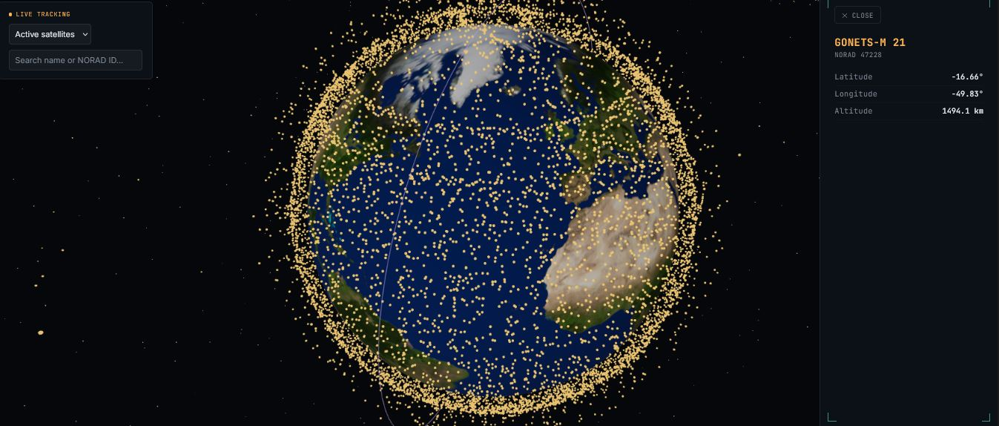

# 🛰️ Satellite Visualizer

A real-time 3D visualization of satellites orbiting Earth, built with a C# backend and a React + Three.js frontend. Orbital positions are computed client-side using real orbital element data (TLE/OMM) from [CelesTrak](https://celestrak.org).




## What it does

- Fetches live orbital element sets (OMM/JSON) from CelesTrak for satellite groups (space stations, active satellites, Starlink, and more)
- Propagates each satellite's real-time position using the SGP4 algorithm — the same orbit-propagation model used in real-world satellite tracking
- Renders Earth and satellites in an interactive 3D scene you can rotate, zoom, and explore
- Click any satellite to view its details (name, NORAD ID, latitude/longitude, altitude) in a side panel
- Draws each selected satellite's orbital path as a trail, spanning one full orbit based on its actual orbital period (so it works correctly for anything from a ~93-minute LEO orbit to a ~24-hour geostationary one)
- Search/filter the currently loaded satellites by name or NORAD ID
- Switch between satellite groups on the fly via a dropdown
- Adjustable position-update interval, for faster or slower live animation
- Styled as a mission-control-style tracking console: dark glass panels, monospace telemetry readouts, HUD-style corner brackets

## Tech stack

**Backend**
- C# / ASP.NET Core (minimal API)
- In-memory caching to avoid hammering CelesTrak's public endpoint
- Fetches and serves orbital element data as JSON


**Frontend**
- React + Vite
- [Three.js](https://threejs.org/) via [`@react-three/fiber`](https://github.com/pmndrs/react-three-fiber) and [`@react-three/drei`](https://github.com/pmndrs/drei)
- [`satellite.js`](https://github.com/shashwatak/satellite-js) for SGP4 orbit propagation (TLE/OMM → real-time position)
- Instanced rendering to efficiently draw hundreds–thousands of satellites in a single draw call

**Data source**
- [CelesTrak](https://celestrak.org) — public orbital element data (GP/OMM format), no API key required

## How it works, briefly

1. The backend fetches orbital element sets (OMM/JSON) from CelesTrak for a requested satellite group and caches the result.
2. The frontend requests this data, then parses each satellite's orbital elements into an SGP4 orbit record using `satellite.js`.
3. On an interval (user-adjustable), the app propagates every satellite to the current time, converting its position from Earth-Centered Inertial (ECI) coordinates into latitude/longitude/altitude.
4. Those coordinates are mapped onto a 3D globe and rendered as instanced points, updated live as time progresses.
5. Selecting a satellite computes its actual orbital period from its mean motion and draws a trail spanning one full loop, centered on the current time.

## Getting started

**Prerequisites:** .NET 8/9 SDK, Node 18+

```bash
# Backend
cd backend/SatViz.Api
dotnet run

# Frontend (separate terminal)
cd frontend
npm install
npm run dev
```

Open the printed local URL (typically `http://localhost:5173`) once both are running.

## Known limitations

- Orbit trails show geometric ground-track shape only; because the trail is plotted in Earth-fixed (lat/lon) coordinates, the two ends won't perfectly close into a loop — this reflects the real westward drift of a satellite's ground track between orbits, not a bug.
- Satellite marker size is currently fixed in scene units, so markers appear larger/smaller depending on camera zoom rather than staying a consistent screen size.

## Roadmap / ideas for later

- [x] Orbit path trails (draw the upcoming/past orbit line, not just current position)
- [x] Search/filter satellites by name or NORAD ID
- [x] Deploy live demo (backend on Render; frontend deployment in progress)
- [x] UI/visual design pass
- [ ] Deploy live demo — backend containerized with Docker for Render; currently investigating CelesTrak requests timing out from some cloud-hosting IP ranges before going live
- [ ] Ground station / visibility overlay (pass predictions) 
- [ ] Camera to satellite animation on click
- [ ] Persistent caching for backend 
- [ ] Scale-aware satellite marker sizing (and other UI improvments)
- [ ] Decoupled scheduled data fetching (using git Actions)

## Data attribution

Orbital element data courtesy of [CelesTrak](https://celestrak.org). Please respect their [usage guidelines](https://celestrak.org/NORAD/documentation/) if you fork or extend this project.

## License

MIT